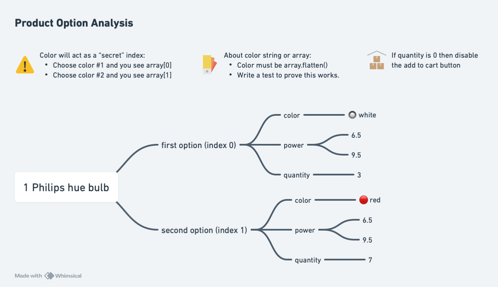

# Lendo Shopping Cart

This is a coding assignment for Lendo.

## Installation

To run locally clone this repository into your computer and then:

1. Install dependencies using `npm clean-install` to ensure using the same version as the project.
1. Run using `npm run dev`.
1. Open your browser and navigate to `http://localhost:5173`.

## Requirements

Create the following views/pages using the mock JSON:

1. 🏠 Product view
   - A list with the name and pricing of each product.
   - The user should view the number of items in the cart.
2. 👠 Detail view
   - A details view where a user can view product details and add the product to the cart.
   - Make sure a product cannot be added if it is unavailable.
   - If a product has variants (colors, sizes, etc) the user should be able to select the variant they want before adding it to their cart.
   - Show visual feedback when adding a product.
3. 🛒 Checkout view
   - A checkout view where a user can see their cart before proceeding with payments.
   - The user should be able to increment and decrement the product quantity as well.
   - As remove the product completely.

## Product option analysis

The tricky part is realizing that **color** serves as the index for product-option. Selecting the first color maps to `array[0]`, the second to `array[1]`, and so on. After that, it’s just a simple filter operation.
